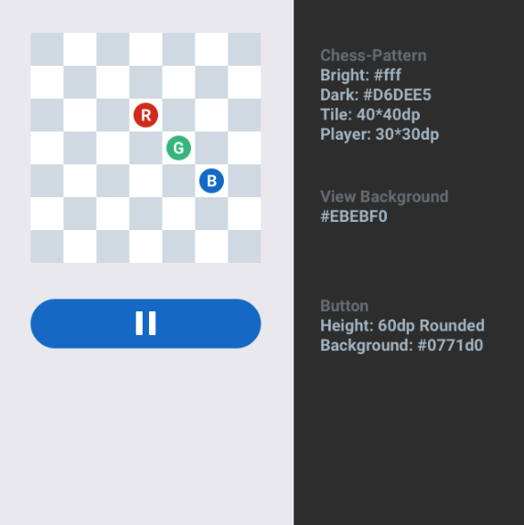

# Android Clean Architecture Sample- Jetpack Compose

# Json Movie

The objective of the challenge is to build an application to move three pieces (players) on a chess
board according to a script which is to be read from a JSON file we provided. To make it easier we
already provided a chess board that you may use. You may update or replace the code provided in the
starter project as needed.

# Instructions

- Each square is represented by coordinates, (0,0) is the bottom left corner of the board.

- The file assets/play.json contains a sequence of movements, describing where each piece (p) is to
  be moved (x,y).

- Below the board is a control button, which can start or pause the movement of the pieces. It
  changes its appearance after having been pressed.

- The script is to be played at one frame per second in sequential order, in other words: There is
  just one piece movement per second.

- An orientation change pauses the movie and continues it when it has finished.

- After the movie has ended, display a “The end” toast to the user and set the button to the “Play”
  state.

# Details

- Transitions of pieces from one point to the next do not have to be animated.

- Pay attention to the provided colours and dimensions

- Since we work with various patterns and approaches in programming, we would be happy to see the
  implementation of any architectural approach in the development of this application.

- As we want to keep your time and effort small, it is not mandatory to write tests, but please
  think about what you would test and how you would approach this when preparing for the subsequent
  technical interview.